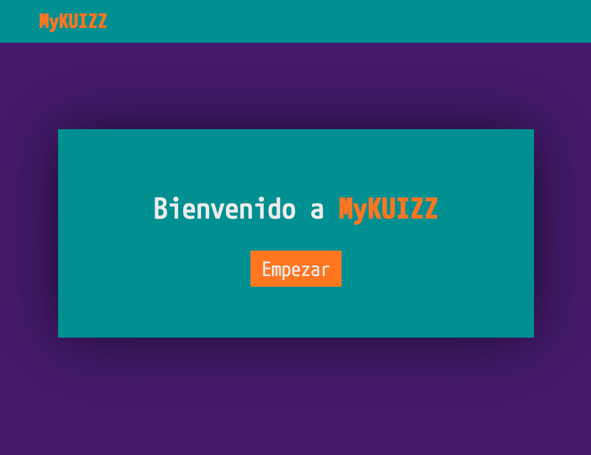
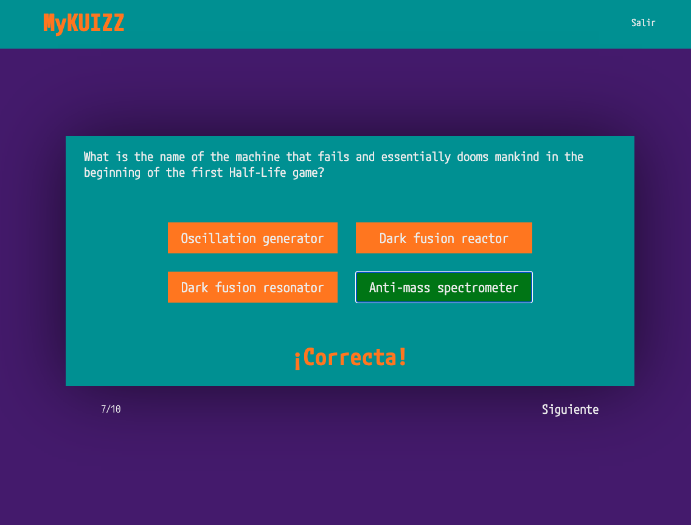
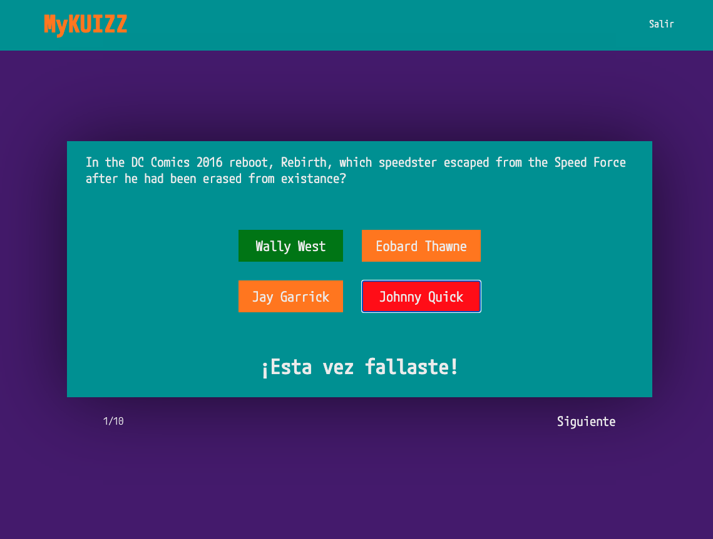
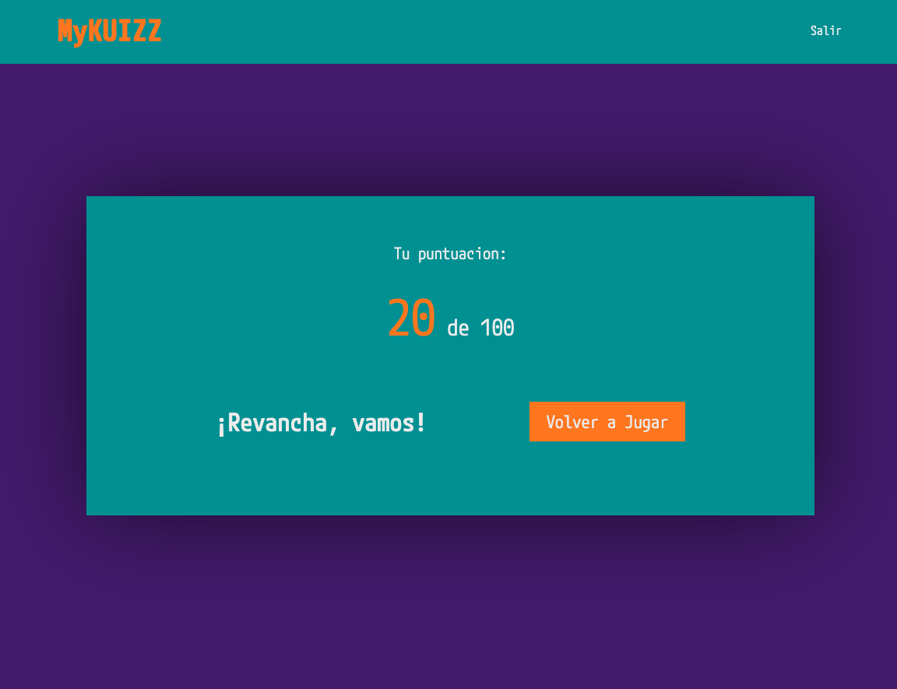

# MyKUIZZ

Juego de quiz realizado como ejercicio práctico utilizando HTML, CSS, JavaScript y llamadas a APIs.

Responde a 10 preguntas aleatorias con 4 respuestas y solo 1 correcta y descubre tu puntuación final al acabar la ronda.

## Imágenes de muestra

## Tecnologias utilizadas

**MyKUIIZ:** HTML, CSS, JavaScript

**APIs:** https://unpkg.com/axios/dist/axios.min.js, https://opentdb.com/api.php?amount=10&type=multiple.

